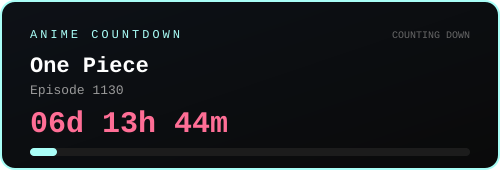

<div align="center">


<br/>

<!--
  NOTE: a live JS countdown can't run in a GitHub README — GitHub strips
  <script> tags from rendered markdown for security. This static block
  keeps the "manga terminal" look without pretending to update live.
-->
<table>
  <tr>
    <td align="center">

```
┌──────────────────────────────────────────┐
│         NEXT DEPLOYMENT COUNTDOWN         │
│                                            │
│         >>  AWAITING MIDNIGHT  <<         │
│                                            │
│   STATUS: WATCHING ANIME, NOT DEPLOYING   │
└──────────────────────────────────────────┘
```

</td>
  </tr>
</table>

<br/>

[](https://github.com/hayaxxdev-bit?tab=followers)
[](https://github.com/hayaxxdev-bit)
[](https://github.com/hayaxxdev-bit)

</div>

<br/>

---

## `// SYSTEM IDENTITY`

```js
const dev = {
  alias     : "hayaxxdev-bit",
  class     : "Lazy Engineer / Anime Veteran",
  status    : "online — probably watching something",
  principle : "if it can be automated, it will be automated",
  fuel      : ["black coffee", "lo-fi anime playlist", "midnight silence"],
  weakness  : "manual tasks that take less than 5 minutes",
  currently : "shipping code no one asked for, at 2AM"
}
```

> spent 5 hours scripting what could've taken 5 minutes.
> no regrets. the script is reusable. the 5 minutes are not.

<br/>

## `// TECH STACK`

<div align="center">


</div>

<br/>

## `// STATS — LIVE FROM THE GRID`

<div align="center">


</div>

<br/>

## `// TROPHIES`

<div align="center">


</div>

<br/>

## `// ACCOUNT — auto-synced, no manual editing needed`

<div align="center">

<!-- META-START -->
| | |
|---|---|
| **Account created** | _run the workflow once to populate this_ |
| **Public repos** | _run the workflow once to populate this_ |
<!-- META-END -->

<!-- META-END -->

</div>

<br/>

## `// REPOSITORIES — auto-synced, no manual editing needed`

<!-- REPOS-START -->
<!-- This section is updated automatically every day by the GitHub Action
     in .github/workflows/update-readme.yml — don't edit it by hand. -->
| Repo | ⭐ Stars | 🍴 Forks | Language | Created | Last Push |
|---|---|---|---|---|---|
| _run the workflow once to populate this table_ | | | | | |
<!-- REPOS-END -->

<sub>Updated automatically every day at 00:00 UTC — see setup instructions below.</sub>

<br/>

## `// ANIME COUNTDOWN`

<div align="center">

<!-- ANIME-COUNTDOWN-START -->
<!-- Auto-generated by scripts/update_anime_countdown.py — don't edit by hand. -->


| | |
|---|---|
| **Title** | _run the workflow once to populate this_ |
| **Time remaining** | _run the workflow once to populate this_ |
<!-- ANIME-COUNTDOWN-END -->

</div>

<sub>Updated automatically every 30 minutes — edit <code>anime_config.json</code> to change what it's counting down to.</sub>

<br/>

## `// ANIME LOG`

```
a programmer who never watched anime
is like code with no comments —
it runs, but the soul is missing.
```

| | |
|---|---|
| **current watch** | classified |
| **all-time favs** | the list is too long |
| **dropped list** | also long, no shame |
| **peak hours** | 23:00 — 03:00 WIB |

<br/>

## `// CONTACT — if it's actually important`

<div align="center">

[](https://github.com/hayaxxdev-bit)

<br/>

```
 __ ___ ______ __ __ ___ ______ ______
/ |/ /___ _/ / / /____/ /_ ___ / |/ /___ _/ /
/ /|_/ / __ `/ /_/ // __/ __ \/ _ \/ /|_/ / __ `/ /
/ /  / / /_/ / __  // /_/ / / /  __/ /  / / /_/ / /
/_/  /_/\__,_/_/ /_/ \__/_/ /_/\___/_/  /_/\__,_/_/
```

— hayaxxdev-bit
  pushing to main from bed.
  no force push. probably.

</div>
