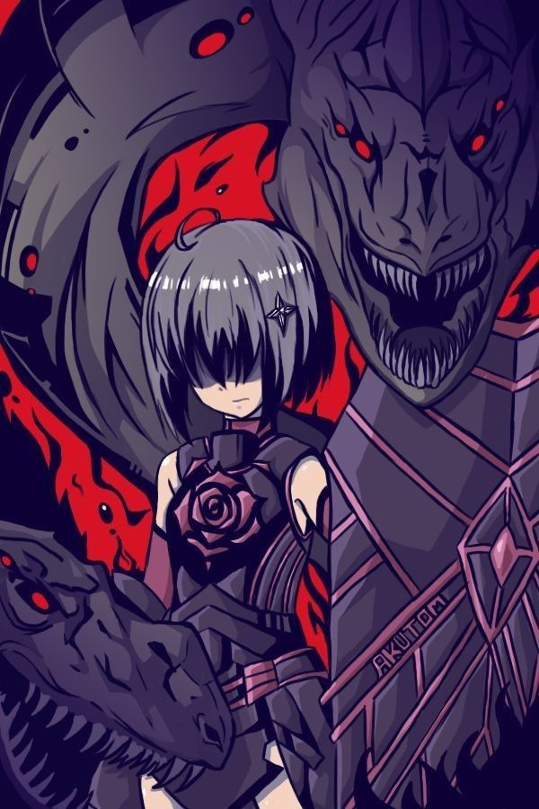

&nbsp;
[](https://wakatime.com/@018c6347-ea45-4be7-9e4a-3ad63a132bc9)

<div align="center">

  

</div>

<div>
  <h3 align="center">"私、ハヤ（影野士道）が"</h3>
  <h3 align="center">シャドウガーデンへようこそお越し下さいました。</h3>
</div>

<div align="center">

<a href="https://github.com/marketplace/actions/update-image-readme">
<!--START_SECTION:update_image-->

<!--END_SECTION:update_image-->
</a>

</div>

<br clear="both">

<h2> About 私自身 </h2>



```cpp
Profile Version: 3.2
--------------------
Level: 十五
-----------
Username: hayaxxdev-bit
WhoamI: Just a School Graduate
        (学校の卒業生)
OS: Kubuntu LTS
Shell: Zsh
Terminal: Visual Studio Code

Location: Unknown
Education: High School Graduate

Interests:
  - Game Development
  - Web Development

Hobbies: Anime, Gaming, Coding
Looking For: A Woman, Maybe 👀

Learning: Docker, Linux, JavaScript
Languages: JS, Python, HTML, CSS
Fav_Subject: Computer Networks, PCB Design

-------------
"自分が立っている場所が頂点だと決めたら、私は決して動かない。"
```

<div align="center">

<p>
  <a href="https://music.youtube.com/">

  </a>
</p>
</div>
<!--📏LINE-->


<h3 align="left">🛠 Language and Tools</h3>


<div align="center">

![][JavaScript] ![][Docker] ![][Linux] ![][HTML5] ![][CSS3] ![][Python]

</div>
<!--📏LINE-->

<h3 align="left">🔍 私の拠点</h3>

<div align="center">

![][CodePen] ![][GitLab] ![][GitHub] ![][Git] ![][Gitpod] ![][DigitalOcean] ![][Github Pages] ![][Bitbucket] ![][Replit] ![][Stack Overflow] ![][Kaggle]

</div>

<!--📏LINE-->

<h3 align="left">🚧 Work in Progress</h3>

![][Docker] ![][MongoDB] ![][React] ![][TailwindCSS] ![][Vercel]

[](https://github.com/hayaxxdev-bit/Nexovra)
[](https://github.com/hayaxxdev-bit/hayaxxdev-bit.github.io)

<!--📏LINE-->

<h3 align="left">🔬 Currently Working on:</h3>

[](https://github.com/hayaxxdev-bit/StoImpo)
[](https://github.com/hayaxxdev-bit/WorkNote)
[](https://github.com/hayaxxdev-bit/RFIDLink)
[](https://github.com/hayaxxdev-bit/SatXtract)

<!--📏LINE-->

<h3 align="left">🚧 Work in Progress</h3>

![][Docker] ![][MongoDB] ![][React] ![][TailwindCSS] ![][Vercel]

[](https://github.com/hayaxxdev-bit/Nexovra)
[](https://github.com/hayaxxdev-bit/hayaxxdev-bit.github.io)

<!--📏LINE-->

<h3 align="left">🔬 Currently Working on:</h3>

[](https://github.com/hayaxxdev-bit/StoImpo)
[](https://github.com/hayaxxdev-bit/WorkNote)

<!--📏LINE-->

<h3 align="left">📈 My Grinds</h3>

<div align="center">

![][Hackerrank] ![][CodeChef] ![][GeeksForGeeks]

</div>

<div align="center"> 👀 </div>

|  |  |
| ----------------------------------------------------------------------------------------- | ------------------------------------------------------------------------------------------ |

<div align="center">
  <a href="https://typograssy.deno.dev/api?text=%E6%80%A0%E6%83%B0%E3%80%81%E6%80%A0%E6%83%B0%E3%80%81%E6%80%A0%E6%83%B0%E3%80%81%E6%80%A0%E6%83%B0%E3%80%81%E6%80%A0%E6%83%B0%E3%80%81%E6%80%A0%E6%83%B0%E3%80%81%E6%80%A0%E6%83%B0%E3%80%82&l0=ffffff&l1=c061cb&l2=9141ac&l3=813d9c&l4=613583&bg=000000&frame=ffffff&speed=245&comment=Generated%20">
  </a>
</div>

<!--📏LINE-->

<h3 align="left">🔥 Statistics</h3>

<div align="center">
  <a href="https://git.io/streak-stats">
    
  </a>
</div>

[](https://github.com/ashutosh00710/github-readme-activity-graph)

<div align="center">


</div>


<!--END_SECTION:waka-->

###

<div align="center">
  
</div>

<br clear="both">
<div align="center">

  <a href="https://git.io/typing-svg"></a>

</div>

<div>

</div>


<!-- SHIELD GROUP -->

[JavaScript]: https://img.shields.io/badge/javascript-%23323330.svg?style=for-the-badge&logo=javascript&logoColor=%23F7DF1E
[Docker]: https://img.shields.io/badge/docker-%230db7ed.svg?style=for-the-badge&logo=docker&logoColor=white
[Linux]: https://img.shields.io/badge/linux-%23FCC624.svg?style=for-the-badge&logo=linux&logoColor=black
[HTML5]: https://img.shields.io/badge/html5-%23E34F26.svg?style=for-the-badge&logo=html5&logoColor=white
[CSS3]: https://img.shields.io/badge/css3-%231572B6.svg?style=for-the-badge&logo=css3&logoColor=white
[Python]: https://img.shields.io/badge/python-3670A0?style=for-the-badge&logo=python&logoColor=ffdd54

[CodePen]: https://img.shields.io/badge/Codepen-000000?style=for-the-badge&logo=codepen&logoColor=white
[GitLab]: https://img.shields.io/badge/gitlab-%23181717.svg?style=for-the-badge&logo=gitlab&logoColor=white
[GitHub]: https://img.shields.io/badge/github-%23121011.svg?style=for-the-badge&logo=github&logoColor=white
[Git]: https://img.shields.io/badge/git-%23F05033.svg?style=for-the-badge&logo=git&logoColor=white
[Gitpod]: https://img.shields.io/badge/gitpod-f06611.svg?style=for-the-badge&logo=gitpod&logoColor=white
[DigitalOcean]: https://img.shields.io/badge/DigitalOcean-%230167ff.svg?style=for-the-badge&logo=digitalOcean&logoColor=white
[Github Pages]: https://img.shields.io/badge/github%20pages-121013?style=for-the-badge&logo=github&logoColor=white
[Bitbucket]: https://img.shields.io/badge/bitbucket-%230047B3.svg?style=for-the-badge&logo=bitbucket&logoColor=white
[Replit]: https://img.shields.io/badge/Replit-DD1200?style=for-the-badge&logo=Replit&logoColor=white
[Stack Overflow]: https://img.shields.io/badge/-Stackoverflow-FE7A16?style=for-the-badge&logo=stack-overflow&logoColor=white
[Kaggle]: https://img.shields.io/badge/Kaggle-035a7d?style=for-the-badge&logo=kaggle&logoColor=white

[Hackerrank]: https://img.shields.io/badge/-Hackerrank-2EC866?style=for-the-badge&logo=HackerRank&logoColor=white
[CodeChef]: https://img.shields.io/badge/CodeChef-%23964B00.svg?style=for-the-badge&logo=CodeChef&logoColor=white
[GeeksForGeeks]: https://img.shields.io/badge/GeeksforGeeks-gray?style=for-the-badge&logo=geeksforgeeks&logoColor=35914c

[MongoDB]: https://img.shields.io/badge/MongoDB-%234ea94b.svg?style=for-the-badge&logo=mongodb&logoColor=white
[React]: https://img.shields.io/badge/react-%2320232a.svg?style=for-the-badge&logo=react&logoColor=%2361DAFB
[TailwindCSS]: https://img.shields.io/badge/tailwindcss-%2338B2AC.svg?style=for-the-badge&logo=tailwind-css&logoColor=white
[Vercel]: https://img.shields.io/badge/vercel-%23000000.svg?style=for-the-badge&logo=vercel&logoColor=white